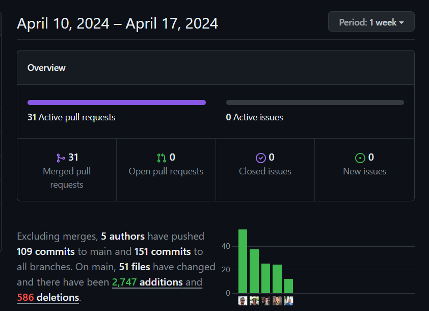

# Journeys End || Let's Enjoy The Journey
- 

Table of Contents

    <ul>
        <li><a href="#description">Description</a></li>
        <li><a href="#languages">Languages</a></li>
        <li><a href="#features">Features</a></li>
        <li><a href="#usage">Usage</a></li>
        <li><a href="#acknowledgements">Acknowledgements</a></li>
        <li><a href="#license">License</a></li>
    </ul>

## Description

    Ever wanted to travel but yet, had no idea what to see when you arrive? or where to go? Well fear not!, this application will show you several ideas of events to check out while your in town!
    While still in development for nationwide events, we've picked some of our favorites to show you what to expect in the future so come back around and check for more soon!

## Languages

- 
- 
- 
- 

<a href="#readme-top">back to top</a>

## Features

- **Weather API Integration:** When a city is selected it renders the current weather as well as the 5 day forecast.
- **Try again Button:** Events are randomized after each click as they are pulled from Ticket Master API.
- **Light/Dark Mode:** Active dark mode toggle that will swap cityscape images on main page and background and font colors on secondary pages
- **Responsive Page / Media Queries:** Website incorporates a responsive design and media queries to make it applicable on most devices.
- **Splash Page:** Website incorporates a splash page as a presentation of what to expect in the main page following.
- **Automation:** Main display page has automated JavaScript to cycle cities with or without user input.
- **API Calling:** Website upon clicking any city will automatically direct you to a page about that location with events from that area.

<a href="#readme-top">back to top</a>

## Usage

The webpage acts as a tool for travelers exploring specific cities, providing recommendations for events to attend. If users aren't satisfied with the initial options, they can explore additional choices by selecting the "try again" button.

* [Journeys End Live Link](https://ivionsters.github.io/Journeys-End/)

* [Journeys End Repo Link](https://github.com/IVIonsters/Journeys-End)

* 

<a href="#readme-top">back to top</a>

## Contibution Screenshot

<a href="#readme-top">back to top</a>

### Tasks and Roles

Zachary Polof

>Developed the main page html and css styling using keyframes and CSS animations. Used JavaScript to create arrow keys to slide through cards. JavaScript based autorun for slider on main page. Implemented splash page and animation behind it. 
---

Peter Smith

>I developed the JavaScript code to fetch and randomize event data from Ticketmaster, integrating it into each page. 
----

Stephanie Carr

>I collaborated on UX/UI design, covering Google Font selection, original image design, and color palette, while also contributing to team organization efforts.
---

David Rauf

>I developed city landing pages as well as developers page. Wrote JS for current and 5 day weather forecast with OpenWeather API integration

---
Joseph Ruff
>I assisted in designing the second page template for each city's webpage, managing CSS for fonts, HTML structuring, and ensuring image consistency. Additionally, I contributed to creating a responsive navigation bar, updating main page photos, and developing the README file.
---

## Team Contact

<a href="#readme-top">back to top</a>

### Zachary Polof

>[IVIonsters](https://github.com/IVIonsters)
---

### Peter Smith

>[peteCodes4u](https://github.com/petecodes4u)
---

### Stephanie Carr

>[sacarr91](https://github.com/sacarr91)
---

### David Rauf

>[drauf727](https://github.com/drauf727)
---

### Joseph Ruff

>[joegruff16](https://github.com/joegruff16)
---

## Acknowledgements

- [Flowbite](https://flowbite.com/)
- [w3 Schools](https://www.w3schools.com/bootstrap5/bootstrap_navbar.php)
- [Unsplash](https://unsplash.com/)
- [Lun Dev Code](https://www.youtube.com/@lundeveloper)
- [dcode](https://www.youtube.com/watch?v=E6B-ig8NHQE)

<a href="#readme-top">back to top</a>

## License

