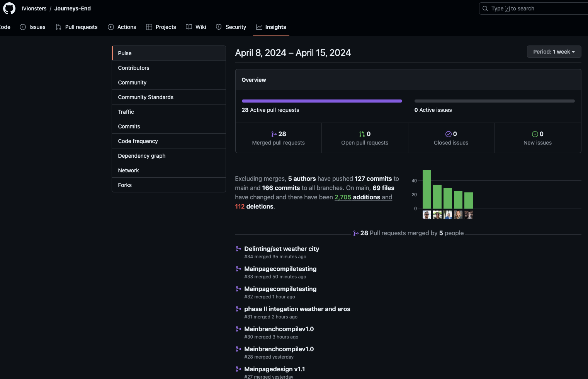

# Journeys End || Lets Enjoy The Journey

Table of Contents

    <ul>
        <li><a href="#description">Description</li>
        <li><a href="#languages">languages</li>
        <li><a href="#features">Features</li>
        <li><a href="#usage">Usage</li>
        <li><a href="#credits">Credits</li>
        <li><a href="#license">License</li>
    </ul>

## Description

    Ever wanted to travel but yet, had no idea what to see when you arrive? or where to go? Well fear not!, this application will show you several ideas of events to check out while your in town!
    While still in development for nationwide events, we've picked some of our favorites to show you what to expect in the future so come back around and check for more soon!

(<a href="#readme-top">back to top</a>)

## Languages

- [HTML5](https://img.shields.io/badge/html5-%23E34F26.svg?style=for-the-badge&logo=html5&logoColor=white)
- [CSS3](https://img.shields.io/badge/css3-%231572B6.svg?style=for-the-badge&logo=css3&logoColor=white)
- [JavaScript](https://img.shields.io/badge/javascript-%23323330.svg?style=for-the-badge&logo=javascript&logoColor=%23F7DF1E)

## Features

- **Weather API:** When City link is clicked on the mainpage weather data is pulled from OpenWeather API for that specific city
- **Try again Button:** Events are randomized after each click as they are pulled from Ticket Master API
- **Light/Dark:** When you click the toggle image on either page it will toggle the background and font color to light or dark mode
- **Responsive Navbar:** The website incorporates a responsive navigation bar across all pages, featuring links that dynamically change their appearance and style when hovered over by the user.
- **Splash Page:**
- **Footer:**

## Usage

    The webpage acts as a tool for travelers exploring specific cities, providing recommendations for events to attend. If users aren't satisfied with the initial options, they can explore additional choices by selecting the "try again" button.

* [Journeys End Live Link](https://ivionsters.github.io/Journeys-End/)

* [Journeys End Repo Link](https://github.com/IVIonsters/Journeys-End)

* 
* 

## Contibution Screenshot

### Tasks and Roles

Zachary Polof

>Developed the main page html and css styling using keyframes and CSS animations. Used JavaScript to create arrow keys to slide through cards and setup autorun to cycle on timer.
---

Peter Smith

>I developed the JavaScript code to fetch and randomize event data from Ticketmaster, integrating it into each page. 
----

Stephanie Carr

>I collaborated on UX/UI design, covering Google Font selection, original image design, and color palette, while also contributing to team organization efforts.
---

David Rauf

---
Joseph Ruff
>I assisted in designing the second page template for each city's webpage, managing CSS for fonts, HTML structuring, and ensuring image consistency. Additionally, I contributed to creating a responsive navigation bar, updating main page photos, and developing the README file.
---

## Team Contact

### Zachary Polof

>[IVIonsters](https://github.com/IVIonsters)
---

### Peter Smith

>[peteCodes4u](https://github.com/petecodes4u)
---

### Stephanie Carr

>[sacarr91](https://github.com/sacarr91)
---

### David Rauf

>[drauf727](https://github.com/drauf727)
---

### Joseph Ruff

>[joegruff16](https://github.com/joegruff16)
---

## Credits

Flowbite for icons

- [Flowbite](https://flowbite.com/)

Used this site code snippet to develop navbar on the second page

- [w3 Schools](https://www.w3schools.com/bootstrap5/bootstrap_navbar.php)

Used unsplash for photos on mainpage

- [Unsplash](https://unsplash.com/)

(<a href="#readme-top">back to top</a>)

## License

